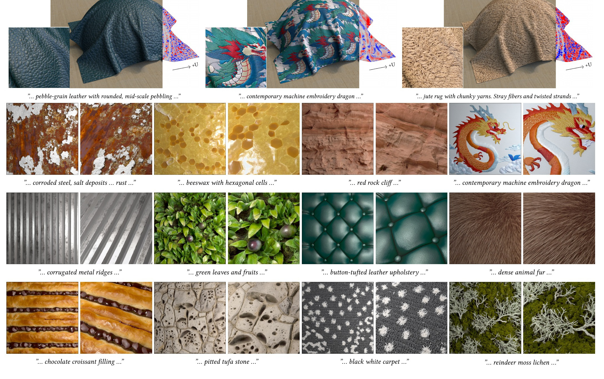

# VideoNeuMat

**Neural Material Extraction from Generative Video Models**<br>
SIGGRAPH 2026

<p align="center">
  <a href="https://bowenxueai.github.io/VideoNeuMat/">Project Page</a> |
  <a href="https://bowenxueai.github.io/">Author Homepage</a> |
  <a href="https://github.com/bowenxueai/VideoNeuMat/releases/download/full-resolution/VideoNeuMat_SIG_2026_full_resolution.pdf">Paper</a> |
  <a href="https://bowenxueai.github.io/VideoNeuMat/assets/supplementary_web.pdf">Supplementary</a> |
  <a href="https://bowenxueai.github.io/VideoNeuMat/assets/neumat_overview.mp4">Video</a>
</p>



## Code

Coming soon.

## Citation

```bibtex
@article{xue2026videoneumat,
  author  = {Xue, Bowen and Hadadan, Saeed and Zeng, Zheng and Rousselle, Fabrice and Montazeri, Zahra and Hasan, Milos},
  title   = {VideoNeuMat: Neural Material Extraction from Generative Video Models},
  journal = {ACM Transactions on Graphics (SIGGRAPH)},
  year    = {2026},
}
```
